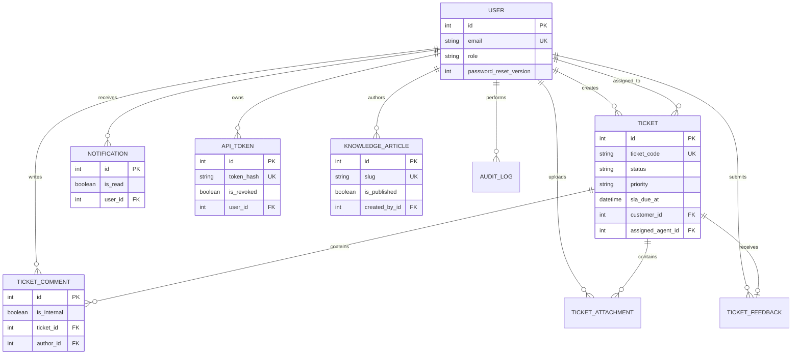

# SupportSphere ER Diagram

```mermaid
erDiagram
    USER ||--o{ TICKET : creates
    USER ||--o{ TICKET : assigned_to
    USER ||--o{ TICKET_COMMENT : writes
    USER ||--o{ TICKET_ATTACHMENT : uploads
    USER ||--o{ TICKET_FEEDBACK : submits
    USER ||--o{ NOTIFICATION : receives
    USER ||--o{ API_TOKEN : owns
    USER ||--o{ KNOWLEDGE_ARTICLE : authors
    USER ||--o{ AUDIT_LOG : performs

    TICKET ||--o{ TICKET_COMMENT : contains
    TICKET ||--o{ TICKET_ATTACHMENT : contains
    TICKET ||--o| TICKET_FEEDBACK : receives

    USER {
        int id PK
        string email UK
        string role
        int password_reset_version
    }
    TICKET {
        int id PK
        string ticket_code UK
        string status
        string priority
        datetime sla_due_at
        int customer_id FK
        int assigned_agent_id FK
    }
    TICKET_COMMENT {
        int id PK
        boolean is_internal
        int ticket_id FK
        int author_id FK
    }
    NOTIFICATION {
        int id PK
        boolean is_read
        int user_id FK
    }
    KNOWLEDGE_ARTICLE {
        int id PK
        string slug UK
        boolean is_published
        int created_by_id FK
    }
    API_TOKEN {
        int id PK
        string token_hash UK
        boolean is_revoked
        int user_id FK
    }
```

The diagram deliberately includes only entities that exist in the current project database.
